# Stream Frame

Watch Netflix and other streaming services on the Steam Frame in full quality. You browse and control playback in a native app on the headset. Every source of video is an extension you can switch on or off: ones without DRM play on the headset itself; DRM-protected services play in a logged-in Chrome on your PC and are streamed to the headset with Sunshine/Moonlight.

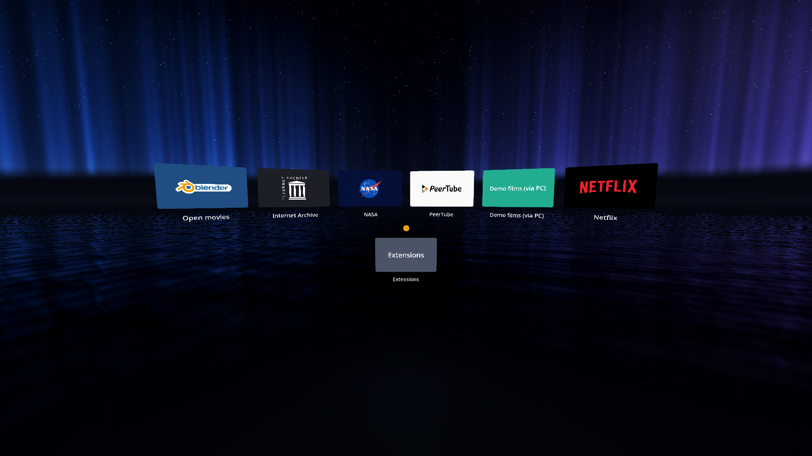

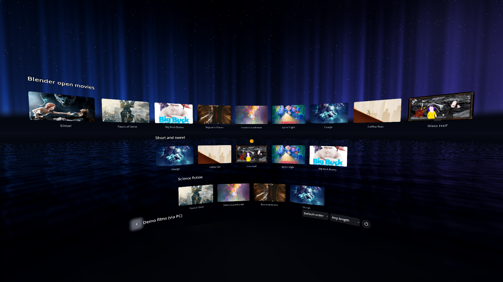

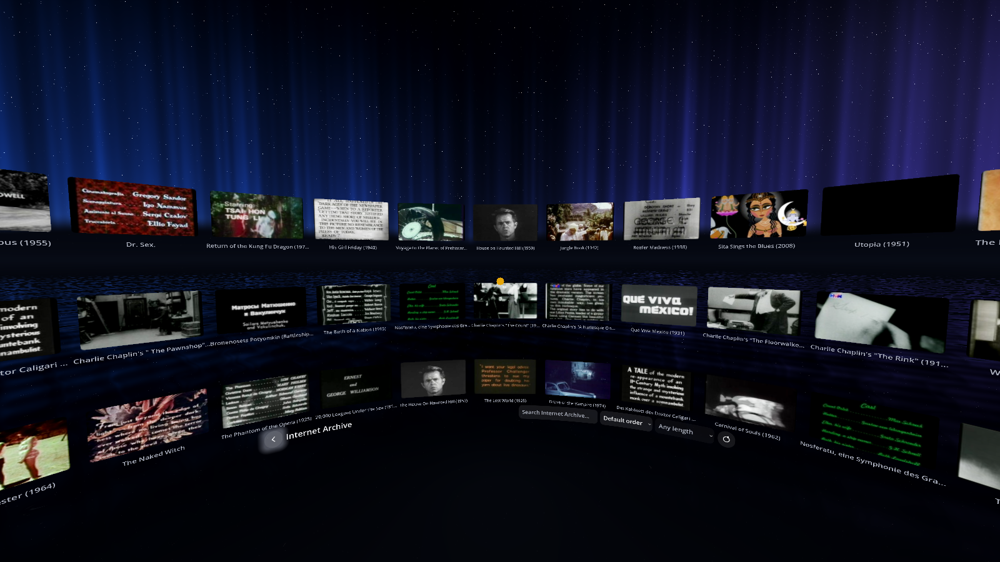

| Content rises in as it loads | Picking a title: its artwork while it starts | Then only the film: lights down, everything else gone |
|---|---|---|
| 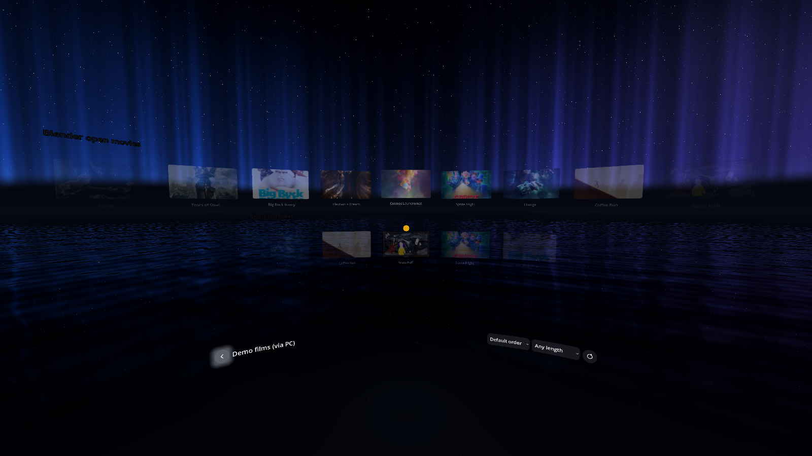 | 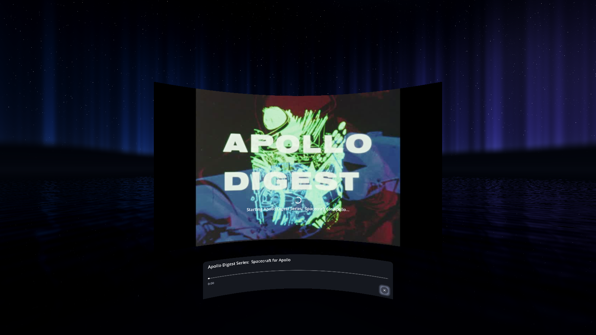 | 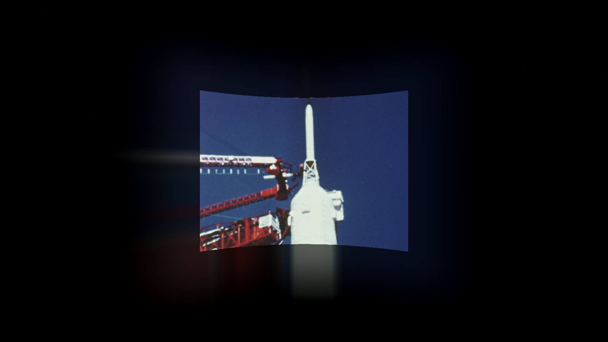 |

While you watch, the picture floats free (black bars baked into the video are left out), a soft glow around it takes the colours at its edges, the room and floor pick up its light, and the screen can be made TV-sized, cinema-sized or IMAX-sized:

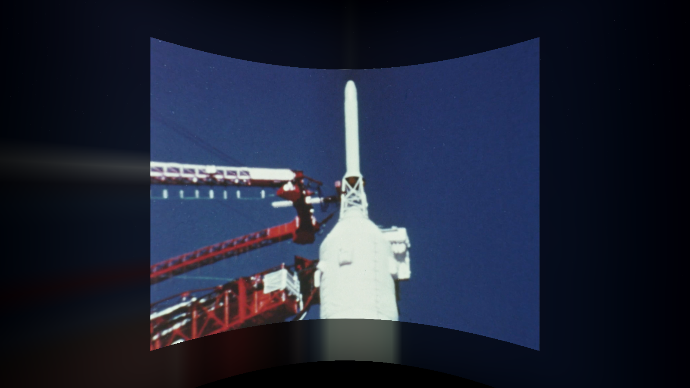

| Look at a poster to highlight it | Pick it and it flies into the screen | Playback controls |
|---|---|---|
| 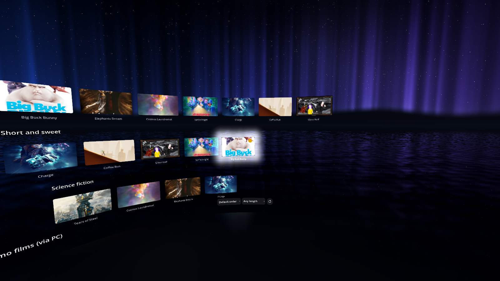 | 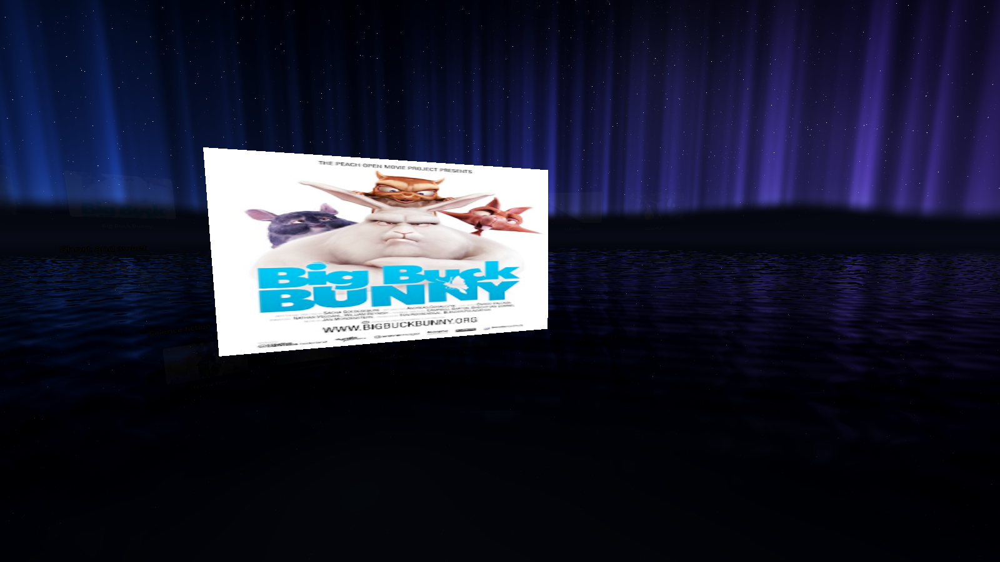 | 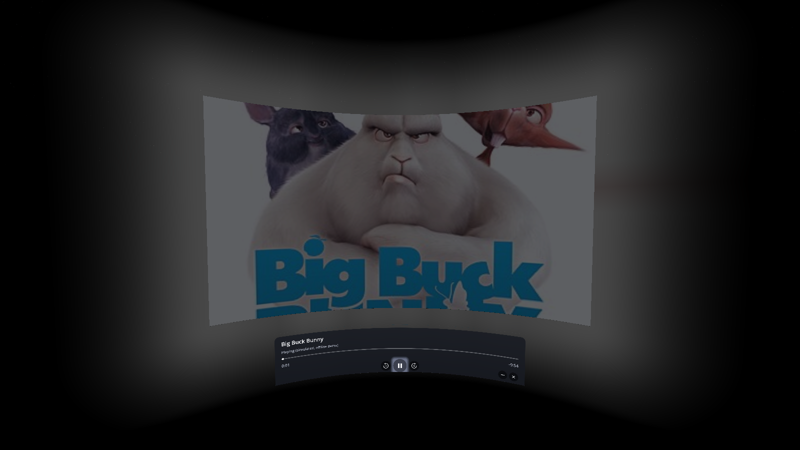 |

| Manage extensions: on/off, configuration, the PC connection | An extension with a problem explains what to do next |
|---|---|
| 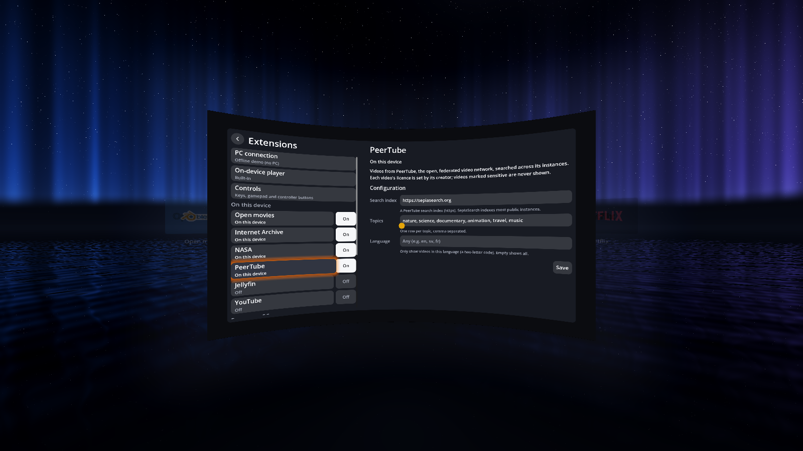 | 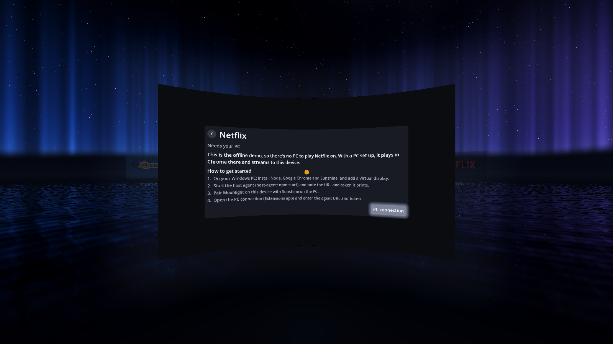 |

The plain 2D UI (`--flat`):

| Browse | Player controls |
|---|---|
| 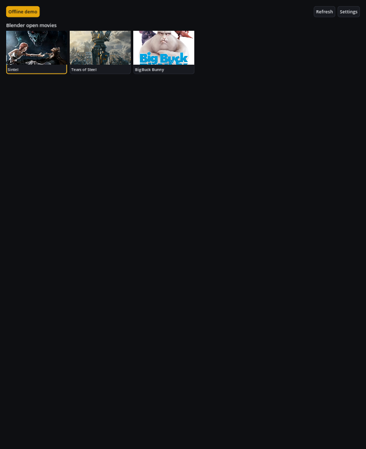 | 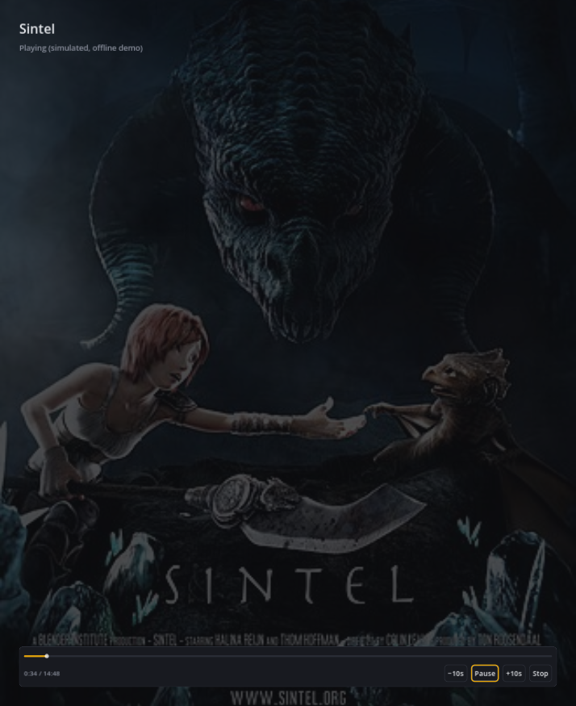 |

## How it works

```
 Frame app ──HTTP/WS──► host-agent ──CDP──► Chrome (logged in, kiosk
 browse + controls      (Node, on PC)       on a virtual display)
     ▲                                             │
     └─────────── Moonlight ◄──── Sunshine ◄───────┘
```

- **host-agent** (`host-agent/`): a Node service on the PC. It drives Chrome, scrapes the catalog and exposes a control API, plus a web remote you can open on a phone.
- **frame-app** (`frame-app/`): a Godot app for the headset. Sources are **extensions**; the home shows the enabled ones, six to a row, ending with the **Extensions** app (whether one plays on the headset or from your PC is its own business; the Extensions app lists them by that):
  - **On this device**: public, DRM-free sources played directly on the headset (no PC needed):
    - *Open movies*: the Blender Studio open films (CC-BY), streamed in 1080p from Wikimedia Commons.
    - *Internet Archive*: thousands of public-domain feature films, silent films, cartoons and classic TV.
    - *NASA*: public-domain mission and science video (Apollo, Artemis, Mars, space telescopes…).
    - *PeerTube*: the open, federated video network, searched across instances via SepiaSearch; configurable search index, topics and language; videos marked sensitive are never shown.
    - *Jellyfin*: your own library from a Jellyfin server (off by default; set the server in Extensions → Jellyfin).
    - YouTube is coming.
  - **From your PC**: DRM-protected services (Netflix; Disney+, HBO Max and Prime Video are listed but off until the host agent supports them), plus *Demo films (via PC)* for checking the PC setup. They share one PC connection. Services the host agent offers that the app doesn't know yet appear as extensions automatically.
  - **Extensions app**: switch extensions on or off, configure them (e.g. PeerTube's topics), set the on-device video player, and set up the PC connection or try the offline demo.
  - Each extension's tile is just the service's logo on its own colour, like the apps on Apple TV. The logos are their owners' trademarks, so none are in this repository: the app fetches each one (from the service's website or Wikimedia Commons) the first time it's shown and caches it on the device, like a browser's site icons. Without a connection, tiles show the name instead.
  - Whatever you look or point at comes forward slightly and glows in its own colours (a poster's, an extension's), its title brightening; posters also tilt towards the pointer. The same highlight is used in every menu, so gaze, controller ray and controller navigation all look alike.

  An extension that can't be used right now says why on its tile (problems in red); launching it explains what's up and what to do next, e.g. a checklist when the PC is offline. If a catalog fails while browsing, *What's wrong?* gives the same help with the error.

  Inside a source, the catalog is a wall of posters wrapped around you in a dark room; picking one flies it into a big curved screen. PC titles open Moonlight once they start.

## How to use it

### Try it without any setup

Requires [Godot](https://godotengine.org/) 4.7.

```sh
frame-app/native/build.sh        # once: builds the built-in video player (needs libmpv dev files, CMake, a C++ compiler)
godot --path frame-app -- --offline
```

Without the built-in player the app still works; on-device titles then open in an external player (mpv by default).

A built-in fake agent serves sample titles and simulates playback with realistic timings (starting a title takes a few seconds, refreshes take longer, seeks rebuffer), so you can try the whole UI, loading states included, with no PC setup. `STREAM_FRAME_DEMO_LATENCY` scales the timings: `0` is instant, `2` is twice as slow.

### 1. Set up the host PC (Windows)

1. Install **Node** 22.18+ and **Google Chrome**. Chromium won't work: it doesn't ship Widevine.
2. Add a **virtual display** with [Virtual Display Driver](https://github.com/VirtualDrivers/Virtual-Display-Driver) (1920×1080@60). Note its position, e.g. right of a 2560-wide monitor → `2560,0`.
3. Install [Sunshine](https://github.com/LizardByte/Sunshine) and set its output display to the virtual display.
4. Allow inbound TCP 8787 through the firewall on your private network.
5. Start the agent, and note the remote URL and token it prints:
   ```powershell
   cd host-agent
   npm install
   $env:WINDOW_POSITION = "2560,0"; npm start
   ```
6. Connect once with Moonlight and log in to Netflix in the Chrome window. The login is kept in a dedicated profile (`~/.stream-frame/chrome-profile`).

On **macOS**, use [BetterDisplay](https://github.com/waydabber/BetterDisplay) for the virtual display and BlackHole for audio, and use Chrome, not Safari.

### 2. Run the app on the headset

1. Install Moonlight on the headset (or any Linux/macOS/Windows machine standing in for it) and pair it with Sunshine.
2. Run `godot --path frame-app`, open **Extensions → PC connection** and enter the agent URL (`http://<pc>:8787`) and token.
3. Pick a title. Playback starts at once while the poster flies to the screen and stays up as a curtain until the film is ready, then fades into it. While you watch, the wall and menus go away and the room is lit by the film; the controls, pointer and lasers stay hidden until you move or point. The controls also set 3D (side by side / top-bottom), screen size, lean back (the screen tilts up for watching reclined) and the glow (off / subtle / strong). Leave a title part-way and it waits on the home under *Continue watching*.

Inside a source, the bar under the wall searches it (on-device sources), sorts it and filters by length; rows load more titles as you scroll to their end. PC titles open Moonlight once video is playing; close the Moonlight window to pause and use the app's own controls.

The app opens on the home: your extensions, six to a row, with Continue watching below. Pick one to browse it; one that isn't ready yet explains what's up and how to get started. Browsing is a curved wall of posters around you, one row per category; it scrolls up and down, and rows longer than the wall scroll sideways. Below the wall float a few controls: back, search, sort and length, refresh. You're outdoors under a starry night sky, standing on still, dark water that stretches off into the dark all around you, with an aurora along the horizon; turn round (Q / E, the right stick, or the mouse at a window edge in the desktop preview) and a low moon lays its path across the ripples ([view](docs/images/shell_behind.png)); when a film starts the sky slowly dims, like a cinema's lights, and it comes back when you stop. Pick a poster and it flies into the big screen. The picture is never covered: the title and playback controls float on their own glass panel just below the screen, fading away while you watch. They're Apple TV-like: the scrubber with elapsed and remaining time, back 10 s / play-pause / forward 10 s, and ⋯ for viewing options (3D, screen size, lean back, glow).

Every button press is a named action (Back, Play / pause, …): **Escape is always Back**, and keys, gamepad, mouse and VR controller buttons can be rebound in Extensions → Controls. The boot splash and app icon are drawn by `frame-app/tools/brand.gd` (run `godot --display-driver x11 --path frame-app res://tools/brand.tscn` to regenerate them). [docs/PERFORMANCE.md](docs/PERFORMANCE.md) has the performance budget, how to measure (`frame-app/tools/perf.gd`) and what's left to do. See [docs/DESIGN.md](docs/DESIGN.md) for the design language (back, controls, focus, colour, motion).

- **In VR** (with an OpenXR runtime): point a controller and pull the trigger to click; the thumbstick scrolls (up/down, and sideways along a row).
- **Desktop 3D preview** (no runtime): your view follows the mouse, like turning your head, and you point with your gaze: the dot in the middle. Click to select, scroll the wheel to move the wall, Shift+wheel to scroll a row sideways.
- Add `-- --flat` for the plain 2D UI.

No headset app? Open the remote URL the agent printed (`http://<pc>:8787/?token=…`) in any browser for the web remote.

### Configuration

| Env var | Default | |
|---|---|---|
| `AGENT_TOKEN` | generated | Required on every API call. If unset, one is generated on first run and kept in `~/.stream-frame/token`. |
| `ALLOWED_HOSTS` | | Extra host names to reach the agent by, comma-separated. IPs, `localhost` and the PC's own name always work. |
| `PORT` / `HOST` | `8787` / `0.0.0.0` | API and web remote |
| `WINDOW_POSITION` | `0,0` | Top-left of the display Sunshine captures |
| `CHROME_PATH` | platform default | Installed Chrome |
| `CHROME_ARGS` | | Extra Chrome flags, e.g. `--disable-gpu` if Moonlight shows black |
| `KIOSK` | `1` | `0` for a normal window while debugging |

The agent controls a logged-in browser, so it is locked down: every call needs the token, other web pages can't call it (JSON-only POSTs, cross-origin requests and WebSocket upgrades refused), and unknown `Host` names are refused to block DNS rebinding.

PC connection settings can be overridden with `STREAM_FRAME_<SETTING>` env vars, e.g. `STREAM_FRAME_AGENT_URL=http://192.168.1.20:8787` or `STREAM_FRAME_MOONLIGHT_COMMAND="flatpak run com.moonlight_stream.Moonlight"`.

## Technical limitations

- **Needs a PC.** Streaming services only decrypt video in licensed DRM. On the headset's own Linux/Android environment that means 480p–720p at most, so playback runs in Chrome on a Windows or macOS host instead.
- **Software DRM only.** Capture works because Chrome's software Widevine path can be screen-captured. Services that reserve their highest resolutions for hardware DRM will serve Chrome a lower one, so don't expect 4K. Safari/FairPlay can't be captured at all.
- **PC streams still open in a separate window.** On-device titles play on the curved screen through the built-in player (libmpv), but PC titles open in Moonlight next to the 3D scene. Embedding the Moonlight stream on the screen is next.
- **The built-in player is software-rendered.** Frames are decoded (with hardware help where available) and copied into a texture each frame, capped at 1920 wide. It's light enough on a desktop; on the headset it needs testing, and it must be built for ARM64 there (`native/build.sh` on the device or a cross-compile) with libmpv available.
- **Netflix is unverified.** The adapter (`host-agent/src/services/netflix.ts`) follows Netflix's known markup but hasn't been tested against a logged-in session yet, so expect broken selectors. The DRM-free **Demo** service works end to end.
- **One viewer at a time.** There is one Chrome and one playback tab. Catalog refresh is refused while something is playing, and playback is refused while a refresh runs.
- **Latency and quality depend on your network.** It's a game stream, so Wi-Fi conditions affect what you see.
- Respect each service's terms of use. This project doesn't bypass DRM; it shows your own logged-in session on your own display.

## Roadmap

Done:
- **Video on the screen** for on-device titles (built-in libmpv player), with **viewing effects**: bias lighting ("Ambilight") around the picture, the room lit by the film, a floor reflection, black bars in the video removed so the picture floats, screen sizes (TV / cinema / IMAX), lean back, **3D films** (side by side, top-bottom; each eye its half in VR) and **resume** with a *Continue watching* row.
- **Sorting and filtering** (A–Z, newest/oldest, shortest/longest; length), **search** inside on-device sources, and **very large catalogs**: rows page in more titles at their end, and the wall keeps only tiles near view alive.
- **Jellyfin**: your own library from a Jellyfin server (works with the public demo server).

Still to do:
- **Moonlight on the screen**: decode the PC stream in-app so PC titles also play on the screen (and get the viewing effects). Needs a Sunshine host to build against.
- **YouTube**: has to use YouTube's own embedded player (their terms), which needs a web view inside the app.
- **Headset builds**: ARM64 export and the built-in player built for the Steam Frame, tested on the device.

## Contributing

Issues and pull requests are welcome. Useful areas:

- **New services**: add an adapter in `host-agent/src/services/` (see `demo.ts` and `types.ts`) and register it in `index.ts`.
- **Netflix testing**: if you have an account, run it and report or fix what breaks.
- **Hosts**: setup notes and fixes for macOS or Linux.

Before opening a PR, run the tests:

```sh
# agent API and security (headless Chromium)
cd host-agent && npm test && cd ..

# full pipeline against a real agent (headless Chromium, fake Moonlight)
GODOT=/path/to/godot frame-app/tests/run_selftest.sh

# on-device extensions against the live services (needs internet)
godot --headless --path frame-app res://tests/providers_test.tscn

# the built-in player, and in-app playback through the whole app (needs internet and native/build.sh)
godot --headless --path frame-app res://tests/mpv_test.tscn
STREAM_FRAME_SETTINGS_PATH=$(mktemp -u) godot --headless --path frame-app res://tests/embedded_test.tscn

# viewing effects, resume, and the catalog tools against live sources (needs internet and native/build.sh)
STREAM_FRAME_MUTE=1 STREAM_FRAME_OFFLINE=1 STREAM_FRAME_SETTINGS_PATH=$(mktemp -u) godot --headless --path frame-app res://tests/viewing_test.tscn
STREAM_FRAME_OFFLINE=1 STREAM_FRAME_SETTINGS_PATH=$(mktemp -u) godot --headless --path frame-app res://tests/catalog_test.tscn

# offline UI and 3D shell
STREAM_FRAME_SETTINGS_PATH=$(mktemp -u) godot --headless --path frame-app res://tests/offline_test.tscn
STREAM_FRAME_OFFLINE=1 STREAM_FRAME_SETTINGS_PATH=$(mktemp -u) godot --headless --path frame-app res://tests/shell_test.tscn
STREAM_FRAME_OFFLINE=1 STREAM_FRAME_SETTINGS_PATH=$(mktemp -u) godot --headless --path frame-app res://tests/input_test.tscn

# loading states (connection error + Retry, skeletons, starting, buffering)
STREAM_FRAME_AGENT_URL=http://127.0.0.1:9 STREAM_FRAME_SETTINGS_PATH=$(mktemp -u) godot --headless --path frame-app res://tests/loading_test.tscn
```

Screenshots in `docs/images/` are rendered by `frame-app/tests/screenshots.tscn` and `shell_screenshots.tscn` (see the header of `shell_screenshots.gd` for running it under Wayland).
