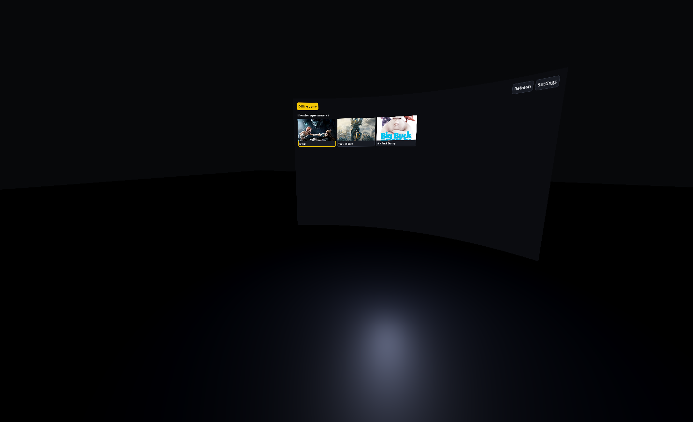

# Stream Frame

Watch Netflix and other streaming services on the Steam Frame in full quality. You browse and control playback in a native app on the headset. The video itself plays in a logged-in Chrome on your PC and is streamed to the headset with Sunshine/Moonlight.


| Browse | Player controls |
|---|---|
|  |  |



## How it works

```
 Frame app ──HTTP/WS──► host-agent ──CDP──► Chrome (logged in, kiosk
 browse + controls      (Node, on PC)       on a virtual display)
     ▲                                             │
     └─────────── Moonlight ◄──── Sunshine ◄───────┘
```

- **host-agent** (`host-agent/`): a Node service on the PC. It drives Chrome, scrapes the catalog and exposes a control API, plus a web remote you can open on a phone.
- **frame-app** (`frame-app/`): a Godot app for the headset. It shows the UI on a curved screen in a dark room and opens Moonlight when a title starts.

## How to use it

### Try it without any setup

Requires [Godot](https://godotengine.org/) 4.7.

```sh
godot --path frame-app -- --offline
```

A built-in fake agent serves sample titles and simulates playback, so you can try the whole UI with no PC setup.

### 1. Set up the host PC (Windows)

1. Install **Node** 22.18+ and **Google Chrome**. Chromium won't work: it doesn't ship Widevine.
2. Add a **virtual display** with [Virtual Display Driver](https://github.com/VirtualDrivers/Virtual-Display-Driver) (1920×1080@60). Note its position, e.g. right of a 2560-wide monitor → `2560,0`.
3. Install [Sunshine](https://github.com/LizardByte/Sunshine) and set its output display to the virtual display.
4. Allow inbound TCP 8787 through the firewall on your private network.
5. Start the agent, and note the remote URL and token it prints:
   ```powershell
   cd host-agent
   npm install
   $env:WINDOW_POSITION = "2560,0"; npm start
   ```
6. Connect once with Moonlight and log in to Netflix in the Chrome window. The login is kept in a dedicated profile (`~/.stream-frame/chrome-profile`).

On **macOS**, use [BetterDisplay](https://github.com/waydabber/BetterDisplay) for the virtual display and BlackHole for audio, and use Chrome, not Safari.

### 2. Run the app on the headset

1. Install Moonlight on the headset (or any Linux/macOS/Windows machine standing in for it) and pair it with Sunshine.
2. Run `godot --path frame-app`, then enter the agent URL (`http://<pc>:8787`) and token.
3. Pick a title. Moonlight opens once video is playing. Close the Moonlight window to pause and use the app's own controls.

With an OpenXR runtime it runs in VR: point a controller and pull the trigger to click, and use the thumbstick to scroll. Without one it opens a desktop 3D preview (right-drag to look around). Add `-- --flat` for the plain 2D UI.

No headset app? Open the remote URL the agent printed (`http://<pc>:8787/?token=…`) in any browser for the web remote.

### Configuration

| Env var | Default | |
|---|---|---|
| `AGENT_TOKEN` | generated | Required on every API call. If unset, one is generated on first run and kept in `~/.stream-frame/token`. |
| `ALLOWED_HOSTS` | | Extra host names to reach the agent by, comma-separated. IPs, `localhost` and the PC's own name always work. |
| `PORT` / `HOST` | `8787` / `0.0.0.0` | API and web remote |
| `WINDOW_POSITION` | `0,0` | Top-left of the display Sunshine captures |
| `CHROME_PATH` | platform default | Installed Chrome |
| `CHROME_ARGS` | | Extra Chrome flags, e.g. `--disable-gpu` if Moonlight shows black |
| `KIOSK` | `1` | `0` for a normal window while debugging |

The agent controls a logged-in browser, so it is locked down: every call needs the token, other web pages can't call it (JSON-only POSTs, cross-origin requests and WebSocket upgrades refused), and unknown `Host` names are refused to block DNS rebinding.

App settings can be overridden with `STREAM_FRAME_<SETTING>` env vars, e.g. `STREAM_FRAME_MOONLIGHT_COMMAND="flatpak run com.moonlight_stream.Moonlight"`.

## Technical limitations

- **Needs a PC.** Streaming services only decrypt video in licensed DRM. On the headset's own Linux/Android environment that means 480p–720p at most, so playback runs in Chrome on a Windows or macOS host instead.
- **Software DRM only.** Capture works because Chrome's software Widevine path can be screen-captured. Services that reserve their highest resolutions for hardware DRM will serve Chrome a lower one, so don't expect 4K. Safari/FairPlay can't be captured at all.
- **The stream is a separate window.** Video opens in Moonlight next to the 3D scene, not on the curved screen.
- **Netflix is unverified.** The adapter (`host-agent/src/services/netflix.ts`) follows Netflix's known markup but hasn't been tested against a logged-in session yet, so expect broken selectors. The DRM-free **Demo** service works end to end.
- **One viewer at a time.** There is one Chrome and one playback tab. Catalog refresh is refused while something is playing, and playback is refused while a refresh runs.
- **Latency and quality depend on your network.** It's a game stream, so Wi-Fi conditions affect what you see.
- Respect each service's terms of use. This project doesn't bypass DRM; it shows your own logged-in session on your own display.

## Contributing

Issues and pull requests are welcome. Useful areas:

- **New services**: add an adapter in `host-agent/src/services/` (see `demo.ts` and `types.ts`) and register it in `index.ts`.
- **Netflix testing**: if you have an account, run it and report or fix what breaks.
- **Hosts**: setup notes and fixes for macOS or Linux.

Before opening a PR, run the tests:

```sh
# agent API and security (headless Chromium)
cd host-agent && npm test && cd ..

# full pipeline against a real agent (headless Chromium, fake Moonlight)
GODOT=/path/to/godot frame-app/tests/run_selftest.sh

# offline UI and 3D shell
STREAM_FRAME_SETTINGS_PATH=$(mktemp -u) godot --headless --path frame-app res://tests/offline_test.tscn
STREAM_FRAME_OFFLINE=1 STREAM_FRAME_SETTINGS_PATH=$(mktemp -u) godot --headless --path frame-app res://tests/shell_test.tscn
```

Screenshots in `docs/images/` are rendered by `frame-app/tests/screenshots.tscn` and `shell_screenshots.tscn`.
